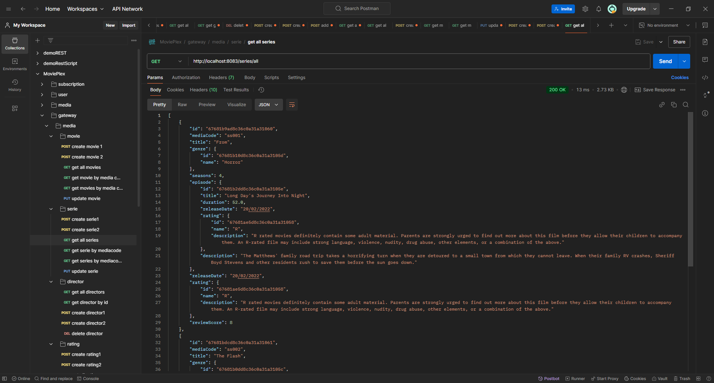
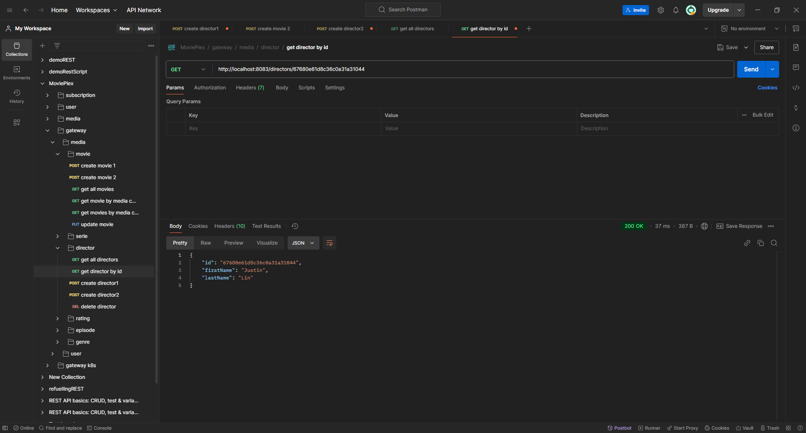
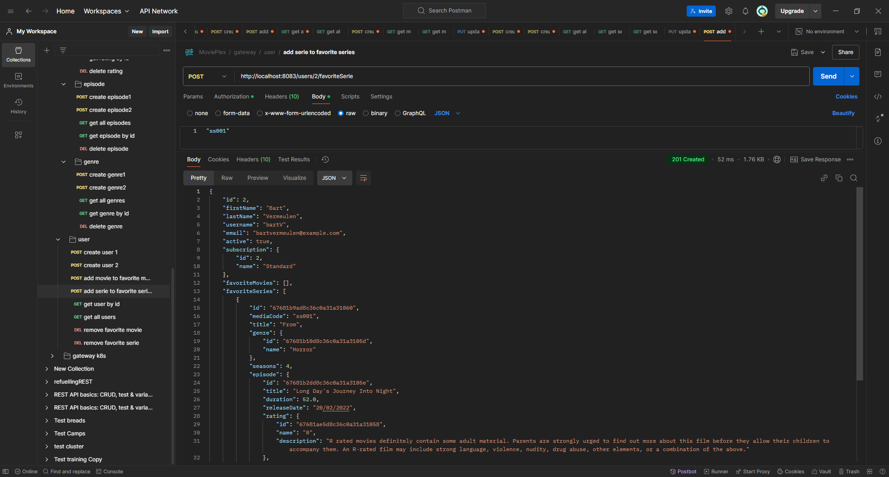
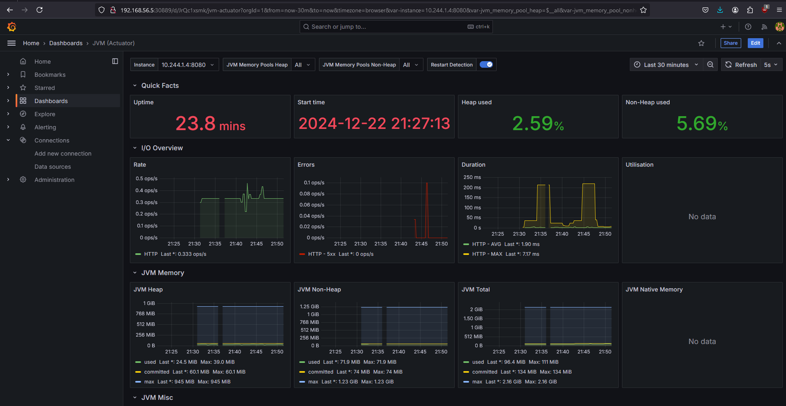

# Advanced Programming Topics - MoviePlex
## Theme

The chosen theme for this project is the creation of a microservices architecture for a streaming service. This architecture uses several microservices, each providing specific functionalities. User Service and Media Service are accessible through the [gateway](api-gateway).

- User Service: only authorized users can use this service.
- Media Service: 
    - GET: no autherization needed
    - POST: autherization needed
    - PUT: autherization needed
- Subscription Service: can't be accessed through the gateway

## Microservices


### [Subscription Service](subscription-service)

Subscription service contains all the subscriptions that MoviePlex has. You can access this microservice through the gateway.

| HTTP Request | Endpoint               | Response                |
|------------- | ---------------------- | ----------------------- |
| GET          | /api/subscription/{id} | Get subscription by id |
| GET          | /api/subscription/all  | Get all subscriptions   |

#### Tests

Tests are written for the services. All tests have 100% coverage on the services. You can find the tests for the subscription service 
- [Subscription tests](subscription-service/src/test/java/fact/it/subscriptionservice/SubscriptionServiceApplicationTests.java)


### [Media Service](media-service)

Media service contains all the movies and series that MoviePlex has. You can access this microservices through the gateway.

| HTTP Request | Endpoint                                    | Response                  |
| ------------ | ------------------------------------------- | ------------------------- |
| GET          | /movies/{mediaCode}                         | Get movie by media code   |
| GET          | /movies?mediaCodes=mediaCode1, mediaCode2   | Get movies by media codes |
| GET          | /movies/all                                 | Get all movies            |
| POST         | /movies                                     | Create movie              |
| PUT          | /movies{mediaCode}                          | Update movie              |

| HTTP Request | Endpoint                                    | Response                  |
| ------------ | ------------------------------------------- | ------------------------- |
| GET          | /series/{mediaCode}                         | Get serie by media code   |
| GET          | /series?mediaCodes=mediaCode1, mediaCode2   | Get series by media codes |
| GET          | /series/all                                 | Get all series            |
| POST         | /series                                     | Create serie              |
| PUT          | /series/{mediaCode}                         | Update serie              |

| HTTP Request | Endpoint                                    | Response                  |
| ------------ | ------------------------------------------- | ------------------------- |
| GET          | /directors/{id}                             | Get director by id        |
| GET          | /directors/all                              | Get all directors         |
| POST         | /directors                                  | Create director           |
| DELETE       | /directors/{id}                             | Delete director           |

| HTTP Request | Endpoint                                    | Response                  |
| ------------ | ------------------------------------------- | ------------------------- |
| GET          | /episode/{id}                               | Get episode by id         |
| GET          | /episode/all                                | Get all episodes          |
| POST         | /episodes                                   | Create episode            |
| DELETE       | /episodes/{id}                              | Delete episode            |

| HTTP Request | Endpoint                                    | Response                  |
| ------------ | ------------------------------------------- | ------------------------- |
| GET          | /genres/{id}                                | Get genre by id           |
| GET          | /genres/all                                 | Get all genres            |
| POST         | /genres                                     | Create genre              |
| DELETE       | /genres/{id}                                | Delete genre              |

| HTTP Request | Endpoint                                    | Response                  |
| ------------ | ------------------------------------------- | ------------------------- |
| GET          | /ratings/{id}                               | Get rating by id          |
| GET          | /ratings/all                                | Get all ratings           |
| POST         | /ratings                                    | Create rating             |
| DELETE       | /ratings/{id}                               | Delete rating             |

#### Tests

Tests are written for the services. All tests have 100% coverage on the services. You can find the tests for the media service here:

- [Movie tests](media-service/src/test/java/fact/it/mediaservice/MovieServiceTests.java)
- [Serie tests](media-service/src/test/java/fact/it/mediaservice/SerieServiceTests.java)
- [Director tests](media-service/src/test/java/fact/it/mediaservice/DirectorServiceTests.java)
- [Episode tests](media-service/src/test/java/fact/it/mediaservice/EpisodeServiceTests.java)
- [Genre tests](media-service/src/test/java/fact/it/mediaservice/GenreServiceTests.java)
- [Rating tests](media-service/src/test/java/fact/it/mediaservice/RatingServiceTests.java)

### [User Service](user-service)

User service contains all users that MoviePlex has. You can access this microservices through the gateway but only when you are authorized.

| HTTP Request | Endpoint                                    | Response                              |
| ------------ | ------------------------------------------- | ------------------------------------- |
| GET          | /users/{id}                                 | Get user by id                        |
| GET          | /users/all                                  | Get all users                         |
| POST         | /users                                      | Create user                           |
| POST         | /users/{id}/favoriteMovie                   | Add movie to favorite movie list      |
| POST         | /users/{id}/favoriteSerie                   | Add serie to favorite serie list      |
| DELETE       | /users/{id}/favoriteMovie{mediaCode}        | Remove movie from favorite movie list |
| DELETE       | /users/{id}/favoriteSerie{mediaCode}        | Remove serie from favorite serie list |

#### Tests

Tests are written for the services. All tests have 100% coverage on the services. You can find the tests for the subscription service 
- [User tests](user-service/src/test/java/fact/it/subscriptionservice/SubscriptionServiceApplicationTests.java)

### Additional Features

- **2.2** Convert the deployment docker-compose.yml to Kubernetes Manifest .yml files
    - **2.2.1** Zet monitoring op met Prometheus en demonstreer met screenshots. 
        - **2.2.1.1** Zet een Grafana om te gebruiken in plaats van de standaard Prometheus Expression Browser met PromQL

## API Requests

### Subscription

**`GET` Get subscription by id**


**`GET` Get all subscriptions**


### Media - Movie

**`GET` Get movie by media code**


**`GET` Get movies by media codes**


**`GET` Get all movies**


**`POST` Create movie**


**`PUT` Update movie**


### Media - Serie

**`GET` Get serie by media code**


**`GET` Get series by media codes**


**`GET` Get all series**




**`POST` Create serie**


**`PUT` Update serie**


### Media - Director

**`GET` Get director by id**



**`GET` Get all directors**


**`POST` Create director**


**`DELETE` Delete director**


### Media - Episode

**`GET` Get episode by id**


**`GET` Get all episodes**


**`POST` Create episode**


**`DELETE` Delete episode**


### Media - Genre

**`GET` Get genre by id**


**`GET` Get all genres**


**`POST` Create genre**


**`DELETE` Delete genre**


### Media - Ratings

**`GET` Get rating by id**


**`GET` Get all ratings**


**`POST` Create rating**


**`DELETE` Delete rating**


### User

**`GET` Get user by id**


**`GET` Get all users**


**`POST` Create user**


**`POST` Add movie to favorite movie list**


**`POST` Add serie to favorite serie list**



**`DELETE` remove movie from favorite movie list**


**`DELETE` remove serie from favorite serie list**


## Vagrant

I used vagrant for creating my VM. You can find my Vagrantfile [here](kubernetes/Vagrantfile). When you start up the VM with vagrant a script will automatically add Docker, Kubectl, Kind and Helm. So you don't have to install these manually. You can find the script [here](kubernetes/script.sh).

## Cluster

### Kind

I used kind for creating my cluster. I made a cluster with two nodes. One node as control-plane and the other as worker node. Also i uses two nodeports. One for my prometheus and the other one for grafana. You have to add the ports in the kind config because otherwise you can't access prometheus and grafana. You can find my kind config [here](kubernetes/kindconfig).

I have split my kubernetes manifest files in a couple parts. Because this is easier to find something when you try to find something. So have i split it up in these parts:
- [Pvc](kubernetes/pvc.yml)
- [Service](kubernetes/service.yml)
- [Deployment](kubernetes/deployment.yml)
- [Ingress](kubernetes/ingress.yml)

Also the order of applying these files is important because otherwise your pods will crash. Also before you can apply these files you need to make a couple namespace first.

#### Demo namespace

```console
kubectl create ns demo
```

#### Monitoring namespace

```console
kubectl create ns monitoring
```

#### Grafana namespace

```console
kubectl create ns grafana
```

Now you are ready for applying the other files.

So you have to first apply the pvc.yml. 
```console
kubectl apply -f pvc.yml
```

After that you have to apply service.yml.
```console
kubectl apply -f service.yml
```

Then the deployment.yml. 
```console
kubectl apply -f deployment.yml
```
And lastly the ingress.yml.

```console
kubectl apply -f https://raw.githubusercontent.com/kubernetes/ingress-nginx/master/deploy/static/provider/kind/deploy.yaml

kubectl apply -f ingress.yml
```

### Prometheus

Now we will add prometheus to the cluster. Also here we need to apply these files in order because otherwise your pod will crash. 

Lets apply the prometheus files now.

#### Pvc.yaml
First you have to add the pvc.yaml file
```console
kubectl apply -f pvc.yaml
```
You can find the pvc file [here](/prometheus/pvc.yaml)

#### Configmap.yaml

Seconf you have to add the configmap.yaml file

```console
kubectl apply -f configmap.yaml
```
You can find the configmap file [here](/prometheus/configmap.yaml)

#### Rbac.yaml

Then you have to add the rbac.yaml file

```console
kubectl apply -f rbac.yaml
```
You can find the rbac file [here](/prometheus/rbac.yaml)

#### Service.yaml

After that you have to add the service.yaml file

```console
kubectl apply -f service.yaml
```
You can find the service file [here](/prometheus/service.yaml)

#### Deployment.yaml

Lastly you have to add the deployment.yaml file

```console
kubectl apply -f deployment.yaml
```
You can find the service file [here](/prometheus/deployment.yaml)

### Result

Normally if everything is started up. Your prometheus will be accessible at **192.168.56.5:30888**.
And you can check then if your applications get scraped by going to the targets.


Then you can make some graphs like this.


## Grafana

Now we will add grafana because prometheus graphs are the prettiest ones.

You can add grafana by applying the [grafana.yaml](grafana/grafana.yaml) file.

```console
kubectl apply -f grafana.yaml
```

If everything of grafana is up then you can go check your dashboard at **192.168.56.5:30889**.

Here you can create your own dashboard now. Some example of my dashboard.




